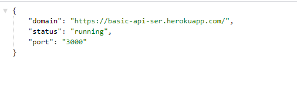

# Lab: Class 03

## basic-api-server

### Deployment Link
- 

### Author: Razan Alamleh
 - [tese report](https://github.com/Razan-am/basic-express-server/runs/3280579477?check_suite_focus=true)
 - [front end]()

### Setup
- .env requirements
  - PORT - 3000

### Running the app
- npm start
  - Endpoint: /status
    - Returns Object

    //

### Tests
- Unit Tests: npm run test

### UML

### Notes
- pull request : https://github.com/Razan-am/basic-api-server/pull/4
- How do I install the app or library?
  - Clone the repo to your local machine
  - in the terminal, `run npm i`
  - Create `.env` file with port name as the one in the `env samples` 
  - Create database called `food` 
  - Seed the database with post request 
  - send in the body for the post request foodType and foodName  

- How do I test the app or library?
1.  in the termenal run `npm run test`
2. in the browser hit `localhost:yourPortNumber/food`

